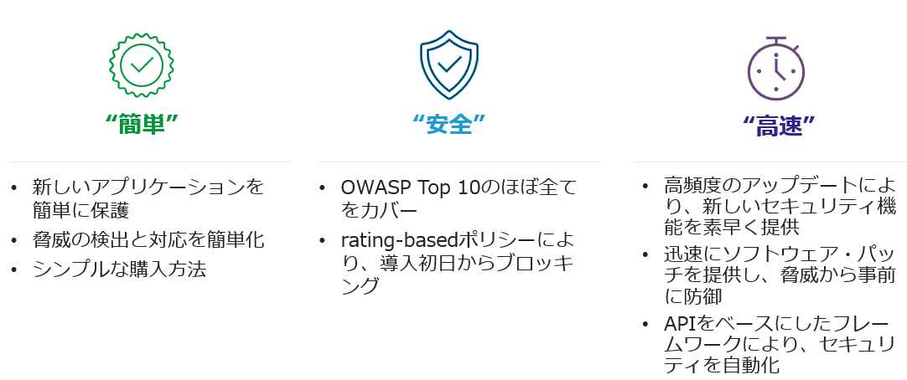

BIG-IP Next WAFとは
======================================

F5 BIG-IP Next WAFとは、OWASP TOP10の攻撃、ウェブアプリケーションの脆弱性、ゼロデイ攻撃、L7レイヤのDDoS攻撃などからWEBアプリケーションを守る高度なウェブアプリケーションファイアウォールです。

BIG-IP Next WAF は、堅牢なセキュリティ ポリシーを作成することによって、有効なアプリケーション トランザクションのみを許可し、バッファ オーバーフロー、SQL インジェクション、クロスサイト スクリプティング、パラメータ改ざん、Cookie ポイズニング、Web スクレイピングなどの対象となるアプリケーション層の脅威から Web アプリケーションを保護します。ポジティブセキュリティ モデルを使用して、検証されたユーザー セッションとユーザー入力、および有効なアプリケーションの応答の組み合わせに基づいてアプリケーションを保護します。また、セキュリティ ポリシーテンプレートにより、一般的なアプリケーションをシンプルかつ迅速に保護できる仕組みを提供しています。

